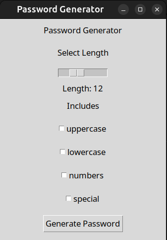

# Password Generator
I built this simple Python-based Password Generator while learning about cybersecurity automation. The goal of the project is to create a user-friendly application that helps users generate strong passwords with customizable options.

### 🎯 Features 
- GUI interface built with tkinter
- Password length customization (via slider)
- Toggle options to include:
    - Uppercase letters
    - Lowercase letters
    - Numbers
    - Special characters
- Automatically ensures:
    - At least one of each selected character type
    - Proper randomization with the `secrets` module
    - Shuffles characters to avoid predictable patterns (e.g., always starting with an uppercase)
- Saves output to `password.txt`
- Handles user errors (e.g. when no options are selected)

### 📁 Project Structure
```
PasswordGenerator/
│
├── generator.py       # Core password generation logic
├── interface.py       # GUI frontend using tkinter
└── password.txt       # Output file for generated password (auto-created)
```

### 🚀 How to run
1. **Clone the repository**
    ```
    git clone https://github.com/maahma/PasswordGenerator.git
    ```
2. **Make sure Python 3 is installed**
    ```
    python3 --version
    ```
    No external libraries are required 

3. **Run the program**
    ```
    python3 interface.py
    ```

### 🖼️ What You’ll See
*Note: The interface design wasn't a priority*


